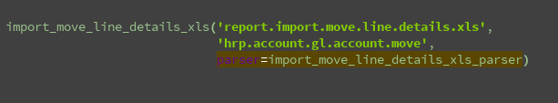
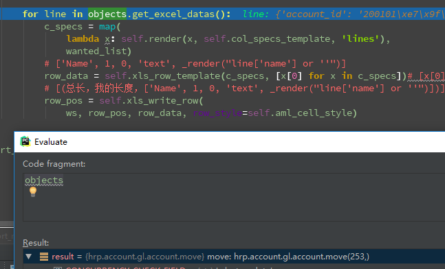

# excel下载

### 结构

class inherit_report_xls(report_xls)<sup>①</sup><br>
class inherit_rml_parse(report_sxw.rml_parse)<sup>②</sup>


1. 第一个python类class继承report_xls,用于控制界面样式调整，主要是重写继承类report_xls中的generate_xls_report方法。
<br>继承report_xls类的class初始化

2. 第二个python类class用于基础数据获取与传递功能。
<br>就是文中的<p style="color:red;">_p</p>

3. 一个odoo类class用于使用odoo的ORM或方法定义获取对应的数据集合。
```text
另外:大多数报表都有相应的弹出界面选择功能，对应的可以使用这个class去定义一些弹出框的选择字段，用作筛选条件。
总之，这个class就是用于各种数据逻辑处理的模型。
```
4. 实例化第一个report_xls类，用于注册使用。
<br>inherit_report_xls('report.report_name'<sup>③</sup>,'报表定义的model'<sup>④</sup>,'inherit_rml_parse'<sup>⑤</sup>)

5. 一个XML,用于定义form弹窗相关的Acion、Form、Report与模型进行绑定

6. 流程：
```text
    实现流程：
    
        创建report_xls的继承类和report_sxw.rml_parse的继承类。
        
        实例化report_xls继承类
        
        创建odoo的class定义字段、写各种方法(例如获取数据下载报表方法print_report，打开报表选择页面的action方法等)。
        
        创建XML来个性化弹出框与选择条件，定义一个print_report按钮，定义一个连接数据对象。
       
    操作流程:
        点击报表菜单 - 弹出一个form界面(可能有参数选择) - 完成后点击打印按钮(print_report) - 报表打印
    
```


<br>另外:
```text
return {
    'type': 'ir.actions.report.xml',
    'report_name': 'nov.account.journal.xls',
    'datas': datas,
    'context':self.env.context}
```
直接return调用report_name的报表，有时候回使用一下context传点个性化的参数。


```xml
<record id="action_import_move_line_details_xls" model="ir.actions.report.xml">
            <field name="name">Import Move Line Details</field>
            <field name="model">hrp.account.gl.account.move</field>
            <field name="type">ir.actions.report.xml</field>
            <field name="report_name">import.move.line.details.xls</field>
            <field name="report_type">xls</field>
            <field name="auto" eval="False"/>
        </record>
```
重要的是model，report_name,report_type：
    model目前我是默认写的objects挂载的模型，和注册中的model名称相同。(后续了解ir.act.report.xml看看model是用来干啥的)
    report_name:python代码中return调用的xls，其实就是ir.act.report.xml的唯一属性。
    report_type:是报表支持的类型，qweb-pdf、qweb-html、pdf、xls、xlsx等。


```text
'name': {
    'header': [1, 25, 'text', _render("_('Name')")],
    'lines': [1, 0, 'text', _render("line['name'] or ''")],
    'totals': [1, 0, 'text', None]},
```
’text'那个位置是用来判断初始化的 ''


```text
import_move_line_details_xls('report.import.move.line.details.xls',
                             'hrp.account.gl.account.move',
                             parser=import_move_line_details_xls_parser)
```
格式：report_xls继承类('xls名称','objects挂载模型','parser对象')
objects挂载模型的意思是，我们excel的数据取值是通过对应的记录来取值的，这里必须选择取数逻辑的model.


我们可以发现它直接定位到了我们打印的单据数据，当然这是在form上或者通过form的一个按钮打开一个Transation的model来打印报表的，如果是那种
放在'更多'中的批量数据打印，我们还需要相应的做一些context的处理。


<sup>逐步理解中...</sup>