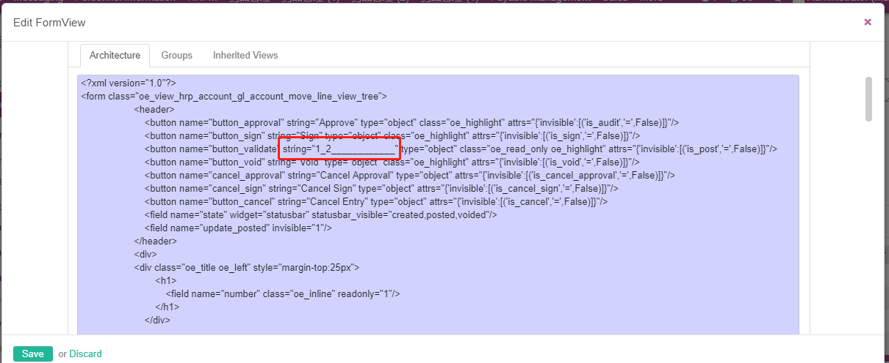
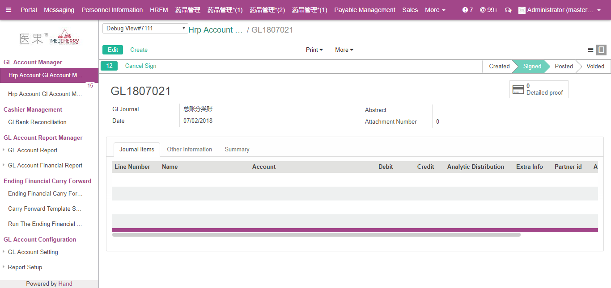

# ir_translation简章

[字段]
>lang
>src
>name
>res_id
>module
>state
>comments
>value
>type

## 几种翻译的加载方式
普通按钮翻译
>直接加载翻译
注:(XML上的按钮翻译旧源不认识下划线_)



报表翻译    
>report:report_name:0 直接加载翻译

菜单翻译
>重启 - 升级 - 加载翻译

字段翻译
>直接加载翻译

code翻译
>直接加载翻译


## 重写源码的字段翻译
> 直接在继承的小模块i18n中重写 module:写原来的或但钱模块的都可以 最后在数据库中会被转换成小模块的 例如:hrp_account
翻译的显示值使用的是id最大的那一个匹配值
```text
#. module: account
#: selection:account.invoice,state:0
msgid "Open"
msgstr "已审批"
```
