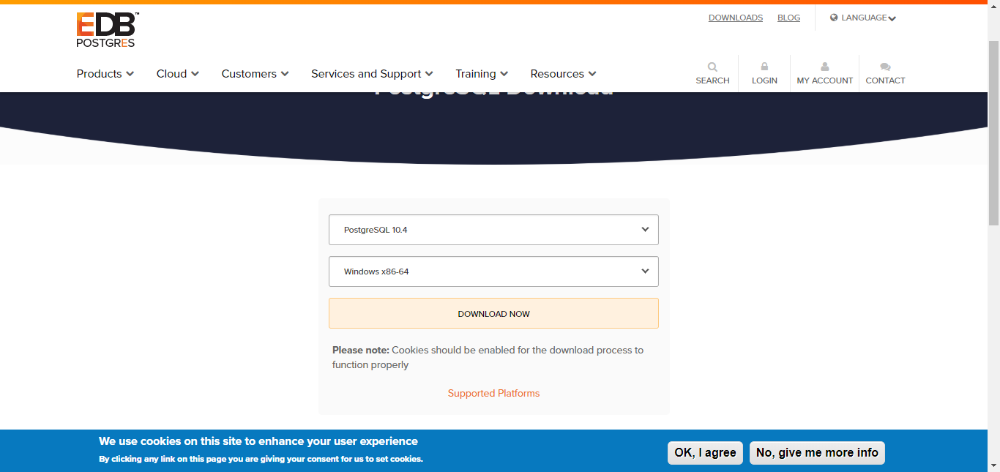

# Odoo11安装

## Odoo11 - Windows - Install

1. 获取github源码，([github地址](https://github.com/odoo/odoo))
2. 通过clone获取源代码
3. 安装底层应用依赖资源：
```text
1.安装python环境
    这里我们使用annacoda3，使用conda指令创建python3.6虚拟环境
    'conda create -n py3od11 python=3.6'
    
2. 配置环境变量path

3. python改名 
    python.exe -> python36.ext
    pythonw.exe -> pythonw36.ext
    
4. 安装必要插件
     python36 -m pip install package_name
        
        pypiwin32 
        
        Pillow-3.4.2-cp36-cp36m-win_amd64.whl 
        
        gevent-1.2.2-cp36-cp36m-win_amd64.whl 
        
        lxml-3.8.0-cp36-cp36m-win_amd64.whl 
        
        psutil-5.3.1-cp36-cp36m-win_amd64.whl 
        
        psycopg2-2.7.3-cp36-cp36m-win_amd64.whl 
        
        pyldap-2.4.37-cp36-cp36m-win_amd64.whl 
        
        reportlab-3.4.0-cp36-cp36m-win_amd64.whl
        
5. 安装odoo必要插件
    $ python36 -m pip install -r requirements.txt
    $ python36 -m pip install -U werkzeug
```

4. 安装完成运行时发现缺少一些关系 虽然这些在requirements.txt包含，但是估计批量没安装成功 我们手动一下
PyPDF2 passlib python-dateutil pywin32 PyYAML Pillow jinja2 html2text num2words

5. 安装必要的pdf打印插件 [下载wkhtmltopdf](https://wkhtmltopdf.org/downloads.html)

6. 启动服务
python36 odoo-bin -s 
这样会生成odoo.conf的配置文件，我们只需要对文件进行配置就ok.
例如我的配置文件:
```text
[options]
addons_path = D:\odoo11plus\odoo\odoo\addons,D:\odoo11plus\odoo\addons,D:\odoo11plus\ytc
admin_passwd = handhand
csv_internal_sep = ,
data_dir = D:\odoo11plus\data_dir
db_host = localhost
db_maxconn = 64
db_name = False
db_password = odoo
db_port = 5433
db_sslmode = prefer
db_template = template1
db_user = odoo
dbfilter = odoo11
demo = {}
email_from = False
geoip_database = /usr/share/GeoIP/GeoLite2-City.mmdb
http_enable = True
http_interface = 
http_port = 8069
import_partial = 
limit_memory_hard = None
limit_memory_soft = None
limit_request = None
limit_time_cpu = None
limit_time_real = None
limit_time_real_cron = None
list_db = True
log_db = False
log_db_level = warning
log_handler = :INFO
log_level = info
logfile = False
logrotate = False
longpolling_port = 8072
max_cron_threads = 2
osv_memory_age_limit = 1.0
osv_memory_count_limit = False
pg_path = C:\Program Files\PostgreSQL\10\bin
pidfile = False
proxy_mode = False
reportgz = False
server_wide_modules = web
smtp_password = False
smtp_port = 25
smtp_server = localhost
smtp_ssl = False
smtp_user = False
syslog = False
test_commit = False
test_enable = False
test_file = False
test_report_directory = False
translate_modules = ['all']
unaccent = False
without_demo = False
workers = None
```

7. 请提前安装postgres10并且创建一个拥有createdb权限的用户 例如：user:odoo pwd:odoo 
对应pg的端口请配置好。
[Postgres下载路径](https://www.enterprisedb.com/downloads/postgres-postgresql-downloads)
